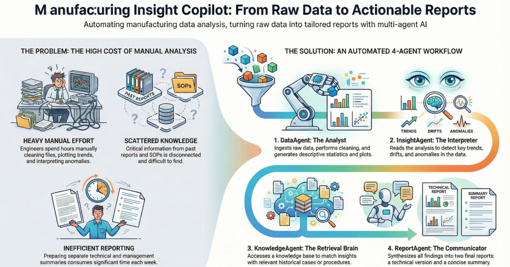

# Manufacturing Insight Copilot (Streamlit + Gemini)

A fully Python workflow that profiles manufacturing datasets locally with pandas/scipy, highlights issues through interactive dashboards, and orchestrates Google Gemini agents to produce insights, knowledge grounding, and structured reports.

## Key Capabilities
- **Secure local profiling** – schema detection, numeric/categorical statistics, correlations, anomaly counts, and time-trend heuristics are computed offline in `tools/data_analysis.py`. Raw data is never sent to Gemini; only curated summaries and five sample rows are shared.
- **Interactive visual analytics** – Streamlit UI offers dedicated tabs for schema review, distributions, correlations, time-series trends, anomaly exploration, batch/equipment variation, yield & quality metrics, PCA dimensionality reduction, and an at-a-glance summary dashboard.
- **Multi-agent reasoning** – Three Gemini-powered agents (Insight, Knowledge, Report) turn the profiling output into technical findings, SOP-aligned context, and Markdown reports.
- **Sample dataset included** – Load `synthetic_production_data.csv` instantly to explore the UI without external files.

## Requirements
- Python 3.10+ (tested with 3.11 via Miniforge).
- Google Cloud project with Gemini API access and a **Goog​le API Key** (`GOOGLE_API_KEY` or `GEMINI_API_KEY`).
- Packages listed in `requirements.txt` (Streamlit, pandas, numpy, scipy, plotly, google-genai, etc.).

## Environment Setup
### 1. Create & activate a virtual environment (recommended)
Miniforge/conda example:
```bash
conda create -n micopilot python=3.11
conda activate micopilot
```

`venv` alternative:
```bash
python -m venv .venv
source .venv/bin/activate        # PowerShell: .venv\Scripts\Activate.ps1
```

### 2. Install dependencies
```bash
pip install -r requirements.txt
```

### 3. Provide your Google API Key
- Preferred: export before running Streamlit
  ```bash
  # PowerShell
  $env:GOOGLE_API_KEY="your_real_key"

  # bash/zsh
  export GOOGLE_API_KEY="your_real_key"
  ```
- Optional: leave the variable empty and paste the key into the Streamlit text box when prompted.

### 4. Launch the app
```bash
streamlit run app.py
```
Visit the URL shown in the terminal (default http://localhost:8501).

## Core Workflow
1. **Upload data or load the sample.** CSV/Excel files are read entirely client-side.
2. **Profiling (`tools/data_analysis.py`).** Generates `DataSummary` dataclass with schema, numeric/categorical profiles, correlation list, anomaly counts, time-trend approximations, raw subset, etc.
3. **Visualization (`app.py`).** Displays the structured analytics tabs described below.
4. **Agent pipeline.**
   - `InsightAgent` (`agents/insight_agent.py`): prunes the profile, serializes it, and asks `gemini-2.0-flash` for trend/anomaly interpretations.
   - `KnowledgeAgent` (`agents/knowledge_agent.py`): grounds insights against the embedded SOP/history snippets in `core/knowledge.py`.
   - `ReportAgent` (`agents/report_agent.py`): synthesizes Markdown technical reports + executive summaries + anomaly bullet list (JSON) using structured prompts.
5. **Results.** Technical report, executive summary, and anomalies list render in Streamlit once the agents finish.

## Visualization Tabs
1. **Data Profiling:** high-level row/column counts, anomaly totals, and schema/role table (collapsible).
2. **Distributions:** Plotly histograms for top numeric columns (up to six).
3. **Correlations:** Heatmap for numeric correlation matrix.
4. **Time Trends:** Line charts of numeric metrics vs. detected index/time column.
5. **Anomalies:** 3σ z-score detector, anomaly table preview, scatter plot highlighting flagged rows.
6. **Batch/Eqp Variation:** Automatically surfaces categorical columns containing terms like batch/line/machine and shows box/column charts to evaluate variation.
7. **Yield / Quality:** Finds columns containing yield/defect/quality keywords and charts trends + summary stats.
8. **Dimensionality Reduction:** Lightweight PCA via SVD to show Component 1 vs. Component 2; colors by first categorical column if available.
9. **Summary Dashboard:** Quick metrics (rows, anomaly count, correlation count), timestamp, and top correlations highlighted.

## Repository Layout
- `app.py` – Streamlit UI, visualization logic, agent orchestration.
- `tools/data_analysis.py` – deterministic profiling pipeline (pandas/scipy/numpy).
- `agents/` – Gemini-based `insight_agent.py`, `knowledge_agent.py`, `report_agent.py` implementations.
- `core/`
  - `config.py` – API key retrieval & `genai.Client` creation.
  - `models.py` – dataclasses representing schema/profile structures and report outputs.
  - `knowledge.py` – embedded SOPs / historical cases used by the KnowledgeAgent.
- `services/`, `components/`, `utils/` – legacy React code retained for reference; Streamlit path does not rely on these files.

## Security & Data Handling
- Raw uploaded data never leaves the local environment. Only aggregated stats (plus 5-row sample) are sent to Gemini.
- API key can be stored as env var or entered ad hoc; it is never persisted by the app.
- Ensure you comply with your organization’s data-handling policies before uploading sensitive manufacturing data.

## Troubleshooting
- **Missing API key / 401 errors:** verify `GOOGLE_API_KEY` is set and the key has Gemini access.
- **Model 404 errors:** the app targets `gemini-2.0-flash`; confirm this model is enabled for your key.
- **NumPy/SciPy errors:** make sure dependencies match `requirements.txt`. Reinstall in a clean environment if needed.
- **Streamlit port conflicts:** pass `streamlit run app.py --server.port 8502` to use a different port.

## Extending the App
- Add additional knowledge sources by expanding `core/knowledge.py` or hooking up external RAG pipelines.
- Enhance profiling rules in `tools/data_analysis.py` (e.g., advanced anomaly detection, control charts).
- Swap or augment visualization logic in `app.py` tabs to reflect plant-specific KPIs.
- Convert the generated Markdown reports into PDFs using libraries like `pdfkit` if needed.

## License
MIT-style; adapt as needed for internal demos or pilots. Contributors should document significant changes in this README to keep downstream users up to date.
